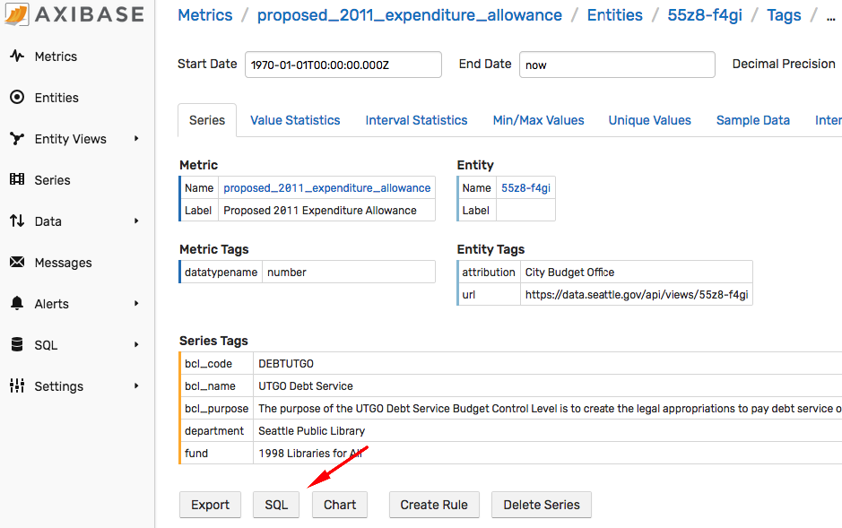

# Time Series Datasets


## Overview

The resource contains [U.S. Government open data](http://www.data.gov/) datasets with a **datetime** dimension.

The total number of entries is **7,190** of **280,000** available in the [catalog](https://catalog.data.gov) and includes only datasets published in [Socrata](https://dev.socrata.com/docs/formats) format.

The listing is grouped by reporting agency (host), category, and catalog tag:

* [Reporting Agencies](./data-hosts/README.md)
* [Categories](./data-categories/README.md)
* [Catalog tags](./data-tags/README.md)

The summary page for each dataset provides metadata about the published information as well as a subset of records in various formats.

Note that some agencies may require a user be authenticated in order to download data.

-----

## Analyzing Data

* To analyze a dataset with [SQL](https://axibase.com/docs/atsd/sql/), load it into [ATSD](https://axibase.com/docs/atsd/), which is optimized for storing and analyzing time-series data.
* Install [Docker](https://docs.docker.com/engine/installation/).
* Download the [`docker-compose.yml`](./resources/docker-compose.yml) file.

  ```bash
  curl -o docker-compose.yml \
    https://raw.githubusercontent.  com/axibase/open-data-catalog/master/resources/docker-compose.yml
  ```

Launch ATSD and [Axibase Collector](https://axibase.com/docs/axibase-collector/) containers and specify the URL to the dataset in the `DATASET_URL` variable.

This tutorial explores [Seattle City Budget Data](./socrata/55z8-f4gi.md) published at the URL below (also listed in the **Data: JSON** field on the dataset summary page).

```elm
https://data.seattle.gov/api/views/55z8-f4gi/rows.json
```

> Remove the `?max_rows=100` parameter from the URL to load the entire dataset.

```bash
export DATASET_URL=https://data.seattle.gov/api/views/55z8-f4gi/rows.json; \
docker-compose up -d
```

Watch for **ATSD start completed** message in the start log.

```bash
docker logs -f atsd
```

```txt
[ATSD] ATSD user interface:
[ATSD] http://172.18.0.2:8088
[ATSD] https://172.18.0.2:8443
[ATSD] ATSD start completed. Time: 2018-06-25 11-03-12.
[ATSD] Collector account 'myuser' created. Type: 'api-rw'.
```

Log in to ATSD web interface on HTTPS port `8443`.

Open the **Entities** tab in the main menu, locate entity `55z8-f4gi` which refers to dataset identifier in the `DATASET_URL` variable and click **Metrics** to view a list of metrics collected in this dataset.


Choose one of the available metrics and click the **Series** icon to open a list of all series collected for this entity and metric.


Select a series and open the **Series Statistics** page. The page contains summary information about the series including metadata published by the reporting agency.



Open **SQL > SQL Console** with a sample pre-generated query that selects last `100` values for the given series.


Customize the query to produce an analytical report, for example:

```sql
SELECT tags."department", SUM(value)/1000000 AS "Total, $M"
  FROM "proposed_2011_expenditure_allowance"
 WHERE entity = '55z8-f4gi'
GROUP BY tags."department"
  ORDER BY SUM(value) DESC
```

Review the results which can be also exported in CSV and Excel formats.

```ls
| tags.department                       | Total, $M |
|---------------------------------------|-----------|
| Seattle City Light                    | 1087.5    |
| Seattle Public Utilities              | 823.9     |
| Finance General                       | 358.9     |
| Seattle Department of Transportation  | 322.0     |
| Seattle Police Department             | 248.5     |
```


Review additional [SQL examples](https://axibase.com/docs/atsd/sql/examples/) for further insights and ideas on how to analyze this and other data.
